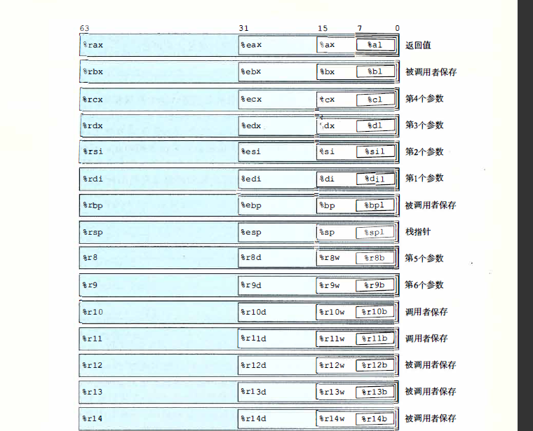
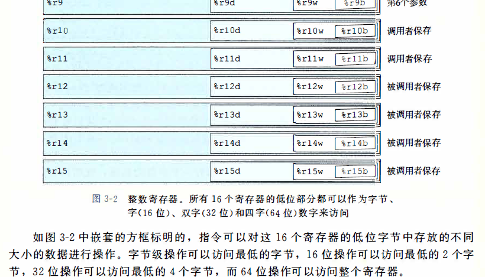

https://github.com/wangcy6/weekly_read/tree/master/book/CSAPP

https://github.com/Talk-Go-CSAPP-05/Discusion

https://talkgo.org/t/topic/

https://github.com/mofaph/csapp

https://pccito.ugr.es/ec/practicas/2a/

## 第四周打卡
> 实验1：通过GDB调试一个简单函数调用c代码，看懂一个函数汇代码和16个寄存器如何被执行的。

- 函数A调用函数B过程参数传递与寄存器关系[3.7章节]

- 栈作用：保存参数（大于6个），局部变量（寄存器），函数调用关系

- 看golang夜读汇编函数A调用函数B,需要保持函数A返回地址。

- FQA：https://github.com/Talk-Go-CSAPP-05/Discusion/issues/14

  

## 第三周打卡

疑问：

- 我怎么观察 函数调用 和寄存器 之间关系，看文字怎么想都想不明白，gdb打印吗？


### 总结 

https://talkgo.org/t/topic/1064/15

> 实验1：通过GDB调试一个简单函数调用c代码，看懂一个函数汇代码和16个寄存器如何被执行的。

- 如果既想显示源代码，又想显示汇编代码，可以使用“layout split”命令
- 16个寄存器

- 函数A调用函数B过程我现在没看懂[3.7章节]

- FQA：https://github.com/Talk-Go-CSAPP-05/Discusion/issues/14

  现在看代码还是看源码，加入gcc 用 03编译，完全看不懂啥意思，尤其是调试

### 记录

- ```shell
  gcc  -Og  -c mstore.c objdump -d mstore.o
  
  gcc  -Og  -S mstore.c cat mstore.s
  
  gcc -g -o prog main.c mstore.c  objdump -d prog 
  
  
  如果既想显示源代码，又想显示汇编代码，可以使用“layout split”命令
  
  layout split
  layout regs
  p $rbp
  ```


代码：https://gitee.com/wang_cyi/study/tree/master/c++_study/2020


汇编：

~~~shell
0000000000400517 <multstore>:
  400517:       53                      push   %rbx 
  400518:       48 89 d3                mov    %rdx,%rbx
  40051b:       e8 ef ff ff ff          callq  40050f <mult2>
  400520:       48 89 03                mov    %rax,(%rbx)
  400523:       5b                      pop    %rbx
  400524:       c3                      retq   
  400525:       66 2e 0f 1f 84 00 00    nopw   %cs:0x0(%rax,%rax,1)
  40052c:       00 00 00 
  40052f:       90                      nop 
  
  寄存器%rbx 
  
~~~






<<<<<<< HEAD


=======


>>>>>>> d1ecb643e890bf4421c013b693562f0153fa15a2

### 阅读资料

- https://xz.aliyun.com/t/2554

- https://www.youtube.com/playlist?list=PLmBgoRqEQCWy58EIwLSWwMPfkwLOLRM5R

- https://www.bilibili.com/video/BV1a54y1k7YE?from=search&seid=11557456987003497790

  

- https://bbs.pediy.com/thread-257246.htm 【10%】

- 第一次阅读 【10%】

  1. http://abcdxyzk.github.io/blog/2012/11/23/assembly-args/ 

  2. https://sourceware.org/gdb/onlinedocs/gdb/Registers.html

  3. https://wizardforcel.gitbooks.io/100-gdb-tips/content/print-registers.html

  4. https://my.oschina.net/zengfr/blog/3196521

  5. https://imhuwq.com/2019/01/31/%E4%BB%8E%E6%B1%87%E7%BC%96%E7%9A%84%E8%A7%92%E5%BA%A6%E7%90%86%E8%A7%A3%E7%A8%8B%E5%BA%8F%EF%BC%88%E4%B8%80%EF%BC%89%E2%80%94%E2%80%94%20%E6%93%8D%E4%BD%9C%E6%95%B0%E6%8D%AE%E7%9A%84%E6%8C%87%E4%BB%A4%E6%B5%81/ 

  6. https://my.oschina.net/zengfr/blog/3196521

  

## 第二周打卡：


汇编指令回顾，下面都是具体例子，先了解，在验证（目前没有验证）

1. call c++ 普通函数调用 call 地址，虚函数 call ptr[i] 是个偏移量。可见代码编译时候不确定对应地址
2. lock volatile 解决缓存内存可可见性， 不解决
3. gcc golang 设置cflag开启内联，print 遍历查看 x 十六进制内容。 写demo打印函数堆栈调用和整数数值。
4. 二进制操作一定看懂 &  ^操作。


## 第一周打卡：

关于 一个程序是如何执行的，具体来说在单核下 执行2个字如何 理解的。

（1） shell 执行fork +exec命令运行一个程序。因此可见程序运行需要一个地址空间，包括只读段，堆栈这些虚拟空间. 这个时候经常进程创建成功。这只是静态部分，如果单任务情况下已经满足了。

（2） 进程执行具体是通过线程调用（默认一个线程）完成的。
场景：在执行过程需要IO操作 鼠标键盘,，网络 信号等任务时候。需要操作系统中断机制 完成协同工作。
例如。通过信号让一个阻塞在慢系统调用的线程从睡眠状态到运行状态。

（3）即使在单核情况下，除去中断外，系统调用也会引起cpu上下文切换。
vmstat 查看 in数量小于cs的印证了，上下文切换触发原因多种。

（4） 有什么办法减少上下文切换？
a ：无锁编程 ，一般锁会触发中断，这里说的锁也是高级抽象。
b： 协程：线程的上下文切换在内核自动完成的。这里用协程代替线程
c：原子操作 。
d：减少线程数量。

因此可见，一个程序运行，这里抽象为进程这个概念。这个概念隐含很多东西，不仅是独占那么简单。需要更加复杂机制。


