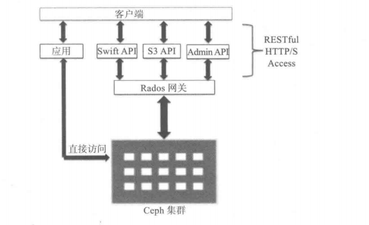

# to_d0

- [ ] Ceph分布式存储学习指南

# Ceph

# TFS:Taobao Filesystem 淘宝分布式系统

- TFS（Taobao FileSystem）是一个高可扩展、高可用、高性能、面向互联网服务的分布式文件系统，主要针对海量的非结构化数据，它构筑在普通的Linux机器 集群上，可为外部提供高可靠和高并发的存储访问。

- TFS为淘宝提供海量小文件存储，通常文件大小不超过1M，满足了淘宝对小文件存储的需求，被广泛地应用 在淘宝各项应用中。它采用了HA架构和平滑扩容，保证了整个文件系统的可用性和扩展性。同时扁平化的数据组织结构，可将文件名映射到文件的物理地址，简化 了文件的访问流程，一定程度上为TFS提供了良好的读写性能。

# MongoDB：

- 支持存储引擎类型：MMAP，WiredTiger和RocksDB

- mongodb存储引擎 （Memory Mapped Storage Engine简称MMAP）采用内存映射方式。

  

