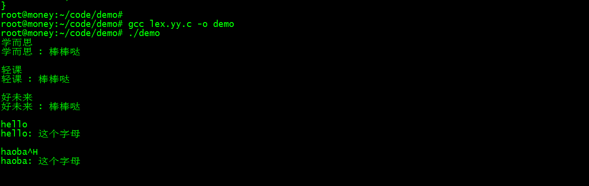
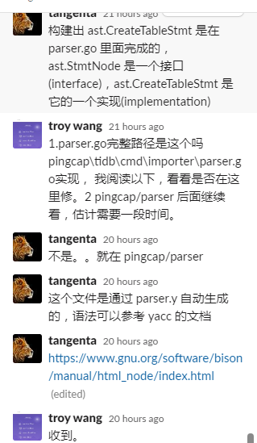
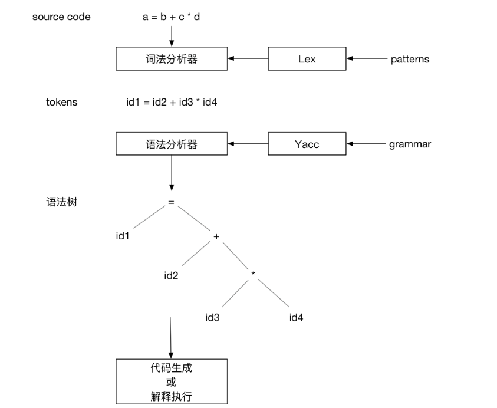

https://github.com/pingcap/tidb/issues/18149


# Lex & YACC HOWTO


参考：https://segmentfault.com/a/1190000022227980

sudo apt-get install byacc flex
lex demo.lex

gcc lex.yy.c -o demo
Lex(LEXical compiler)和yacc(Yet Another Compiler Compiler),Lex 是一种生成扫描器的工具。扫描器是一种识别文本中的词汇模式的程序。yacc是语法分析器。



```mysql
mysql> CREATE TABLE t10(x INT, KEY ``(x));
ERROR 1280 (42000): Incorrect index name ''

 CREATE TABLE t10(x INT, KEY (x));
  CREATE TABLE t10(x INT, KEY (x));
  

ALTER table t10 ADD key x_index (x);
show index from t10 \G;

drop table t11;
CREATE TABLE t11(a INT,b INT,C INT,KEY ``(a,b) );
ALTER table t11 ADD key '' (a);

drop table t11;
CREATE TABLE t11(a INT,b INT,C INT,KEY `aa`(a,b) );

CREATE TABLE t11(a INT,b INT,C INT,KEY `123`(a,b) );
show index from t11 \G;
drop table t11;
CREATE TABLE t11(a INT,b INT,C INT,KEY 12333(a,b) );

CREATE TABLE t11(a INT,b INT,C INT,KEY ``(a,b) );

CREATE TABLE t12(a INT,b INT,C INT);
ALTER table t12 ADD key ''(a);
mysql> ALTER table t12 ADD key ''(a);
ERROR 1064 (42000): You have an error in your SQL syntax; check the manual that corresponds to your TiDB version for the right syntax to use line 1 column 26 near "''(a)" 

mysql> ALTER table t12 ADD key ''(a);
ERROR 1064 (42000): You have an error in your SQL syntax; check the manual that corresponds to your MySQL server version for the right syntax to use near '''(a)' at line 1
mysql> 
drop table t12;
CREATE TABLE t12(a INT,b INT,C INT);
create index `` on t12 (a);
create index `` on t12 (a);
create index `              ` on t12 (a);
show index from t12 \G;

简单说字符串用单引号，表名，字段名等用反引号

```


### 测试用例：mysql报错，Tidb

~~~mysql
### 三个

CREATE TABLE t10(x INT, KEY ``(x));

create index `` on t12 (a);

ALTER table t12 ADD key ''(a);
show index from t10 \G;
~~~

### 流程图

https://zhuanlan.zhihu.com/p/43088324


### 沟通产生思路

- 经过一星期的尝试，在ddl 对相关语法检查 根本无法通过长度来判断，必须在param

  

  

### 准备


- https://pingcap.com/blog-cn/tidb-source-code-reading-5/
- https://www.gnu.org/software/bison/manual/html_node/index.html
- https://github.com/pingcap/parser
- https://pingcap.com/blog-cn/30mins-become-contributor-of-tidb-20190808/

### 修改范围


代码位置：https://github.com/pingcap/parser


- func (d *ddl) CreateTable(


checkTableInfoValidWithStmt -->checkPartitioningKeysConstraints-->CreateTableWithInfo

checkInvisibleIndexOnPK

- - CreateIndex  Anonymous
- func (d *ddl) AlterTable(

 ---AlterTableAddConstraint-->


 checkConstraintNames


- [ ] checkIndexInfo


checkCreateTableGrammar

- [ ] checkConstraintNames


- [ ] 如何解析一个sql句子

~~~
// Parse parses a query string to raw ast.StmtNode.
func (s *session) Parse(ctx context.Context, sql string) ([]ast.StmtNode, error) {
~~~


### 我的思路



我们把 TiDB Parser 整体看作一个函数，输入是 SQL 字符串，输出是用于描述 SQL 语句的抽象语法树（AST）。

在这个转换的过程中涉及到的组件有两个：

一个是 lexer，负责将字符流变成 Token，并赋予它们类别标识，这个过程叫「Tokenize」；

另一个是 parser，负责将 Token 转为树状结构，便于将来遍历和转换，这个过程叫「Parse」；

TiDB 使用了 parser 生成工具 goyacc，它能够根据 `parser.y` 生成 `parser.go`，其中包含了名称为 `Parse` 的函数接口，供 TiDB 直接使用。

更多关于 TiDB Parser 以及 Lex & Yacc 的信息请参考 [TiDB SQL Parser 的实现](https://pingcap.com/blog-cn/tidb-source-code-reading-5/)。


