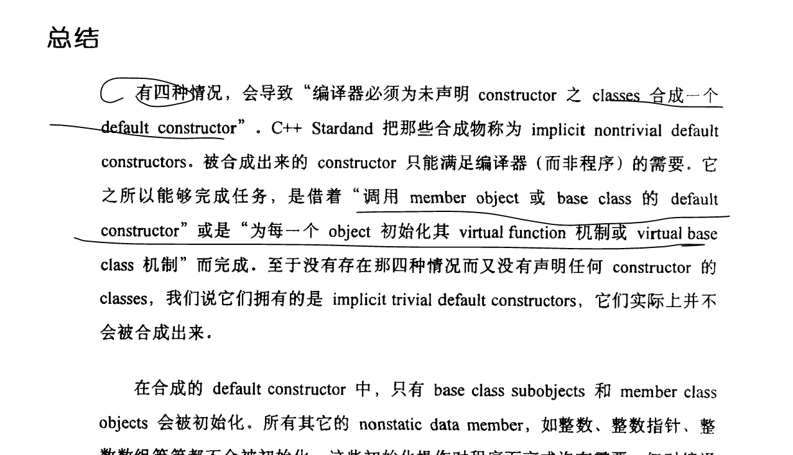
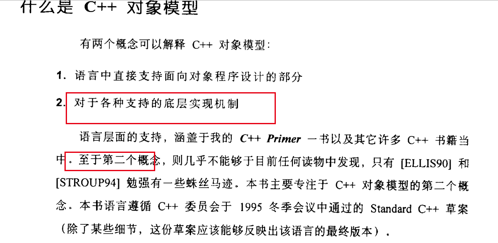
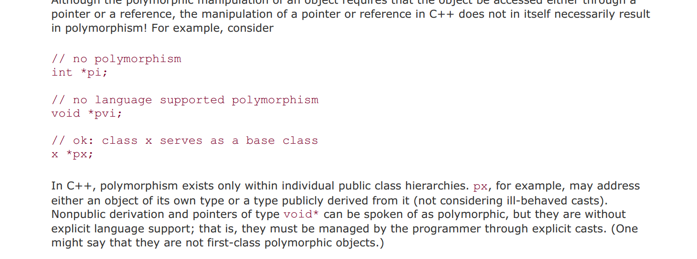
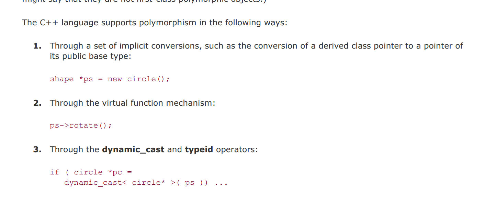
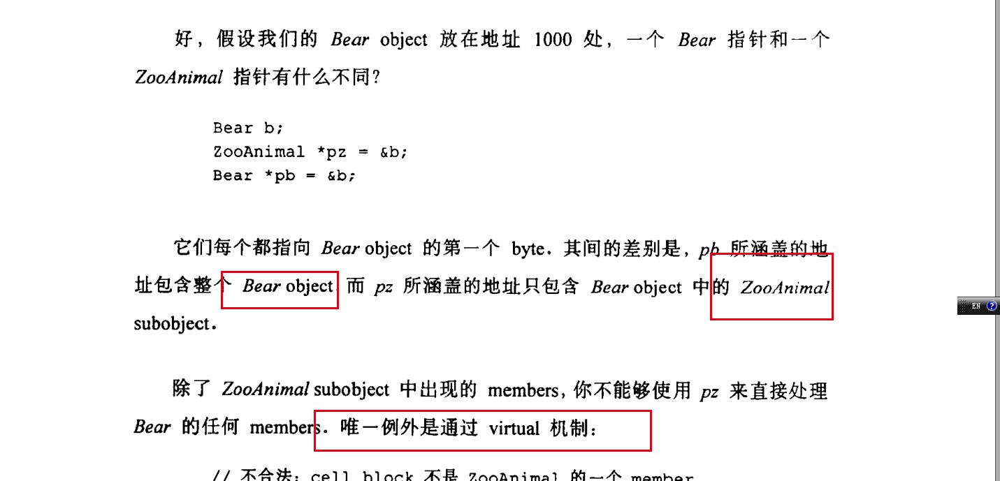
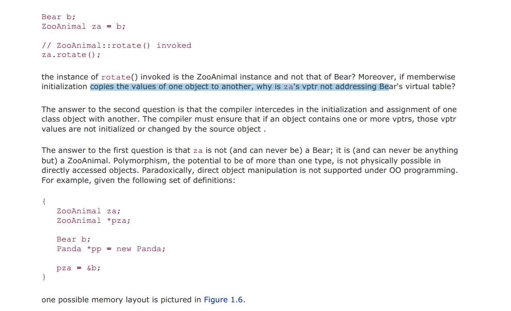

# 

# Inside The C++ Object Model

# C++ Primer   

# note

### Chapter 6. Functions  

6.4.1. Overloading and Scope

In C++, name lookup happens before type checking.

6.5.1. Default Arguments  

6.5.2. Inline and constexpr Functions

### Chapter 12. Dynamic Memory  

Global objects are allocated at program start-up and destroyed when the program
ends  

Local, automatic objects are created and destroyed when the block in which
they are defined is entered and exited  

Local static objects are allocated before
their first use and are destroyed when the program ends.  

>Programs use
>the heap for objects that they dynamically allocate  

- Dynamic Memory and Smart Pointers  [563]

In C++, dynamic memory is managed through a pair of operators: new,  

To make using dynamic memory easier (and safer), the new library provides two
smart pointer types that manage dynamic objects  

- 12.1.1. The shared_ptr Class  

The safest way to allocate and use dynamic memory is to call a library function named
make_shared  

We can think of a shared_ptr as if it has an associated counter, usually referred to
as a **reference count**. Whenever we copy a shared_ptr, the count is **incremented**  

Once a shared_ptr’s counter goes to zero, the shared_ptr automatically frees
the object that it manages:  

## Chapter 16. Templates and GenericProgramming

The distinction between the
two is that OOP deals with types that are not known until run time, whereas in
generic programming the types become known during compilation  